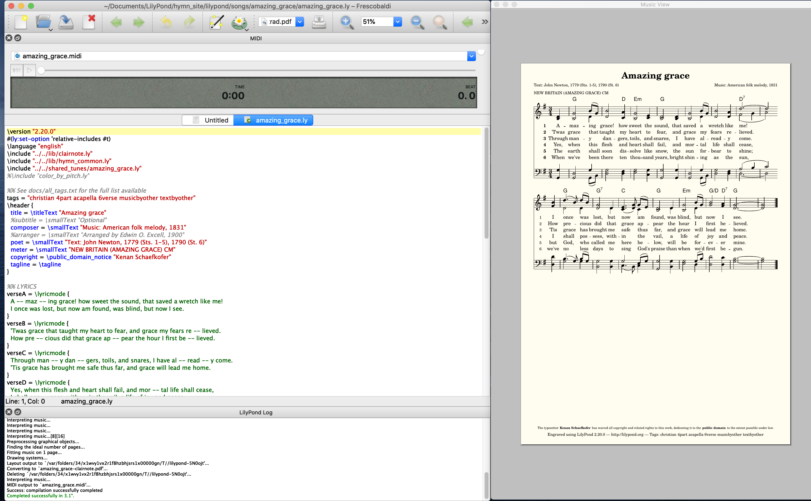

---
---

# Contributing using Lilypond

All the songs on the site are written using Lilypond, which is a way to describe a musical score using code.

### Installing

You will need:
 - If on Windows, you'll probably want [Windows Subsystem for Linux](https://docs.microsoft.com/en-us/windows/wsl/install-win10)
 - [Lilypond](http://lilypond.org/download.html), the program that turns a file of code: `my_song.ly` into outputs `my_song.pdf` and `my_song.midi`. Hymn Singer currently uses 2.20.0, and the newer versions may be fine.
 - [Frescobaldi](https://frescobaldi.org/download), the easiest way to get started with Lilypond on Linux, Mac, or Windows.
 - (optional) [Git](https://git-scm.com/downloads)

If you want to _hear_ the music, you may need to install a program to play `.midi` files:
 - Linux: https://github.com/frescobaldi/frescobaldi/wiki/MIDI-playback-on-Linux
 - Mac: https://github.com/frescobaldi/frescobaldi/wiki/MIDI-playback-on-Mac-OS-X

### Clone the git repository

You're going to copy this entire website, including all the songs, to your computer using Git.
- Go to https://github.com/kenanbit/hymn-singer
- Click the big green download button. If you installed git, you can use the `clone` command. Otherwise, you can download a zip and unzip it.

### Getting one of Hymn Singer's songs to engrave correctly

Time to "Engrave" (meaning turn the `.ly` file into `.pdf` and `.midi` outputs):
- Open Frescobaldi
- Open the source code (the `.ly` file) for one of the songs. For example, "Angels we have heard on high" is at `lilypond/songs/angels_we_have_heard_on_high/angels_we_have_heard_on_high.ly`
- Hit the lilypad button to engrave. It should look something like this:

- If the notation looks strange to you, you need to use the dropdown menu to select a different PDF file to view. One of them is traditional notation, one uses shape-note heads, and one uses Clairnote notation.

### Leverage your individual creative energies

Experiment by changing something!
- Maybe change the title, or some of the lyrics and see if your changes show up in the PDF.
- Change some note letters in the `soprano = `, `alto = `, etc. For example, maybe change the first `a4` to `gs4` to change the soprano's first quarter note from `A` to `G#`.
- Then go [learn the basics of Lilypond](https://lilypond.org/doc/v2.20/Documentation/learning/simple-notation)

### Creating a new song

To create a song called "My Song", run the script `scripts/new_song_from_template.sh my_song`. This just copies the a template file into a new file at `lilypond/songs/my_song/my_song.ly`.

TODO: add more details.

### Adding your new song to the website

Email it to me or use a Github PR.

TODO: add more details.

### Ok, but what if I want to do [weird special-case thing?]

Here are a list of common Lilypond tasks that are easy to forget, and an example song that does it well:

| Task      | Example song |
| ----------- | ----------- |
| Italic lyrics | Wakantanka |
| Single staff | Wakantanka |
| Dotted slur (lyrics ignore) | Wakantanka |
| Shared tune between several songs | All praise to thee, my God, using the shared tune Tallis Canon |
| Canon / Round | Tallis Canon |
| Double column lyrics at the end | Religion fit to last |
| Single column lyrics at the end | We shall overcome |
| Alternating Leader/All or Unison/Harmony | When Israel was in Egypt's land |
| Chorus / Refrain lines condensed to one line without ruining the lyrics extractor | All creatures worship God most high |
| Fermatas (up and down facing) | All creatures worship God most high |
| Alternate title | All creatures worship God most high |
| Score zoomed to fit on one page (both traditional notation and clairscore) | All creatures worship God most high |
| Two lyrics languages in the staff | Heilig, Heilig, Heilig |
| Custom lyric labels on certain lines | Heilig, Heilig, Heilig |
| Different lyrics for each of 2 staffs | Warm Summer Sun |
| One part in a staff resting while the other sings | O come all ye faithful |
| Different lyrics for the same staff (e.g. soprano v. alto) | When peace like a river |
| Double staff switch to single staff in same song | La paz de la tierra |