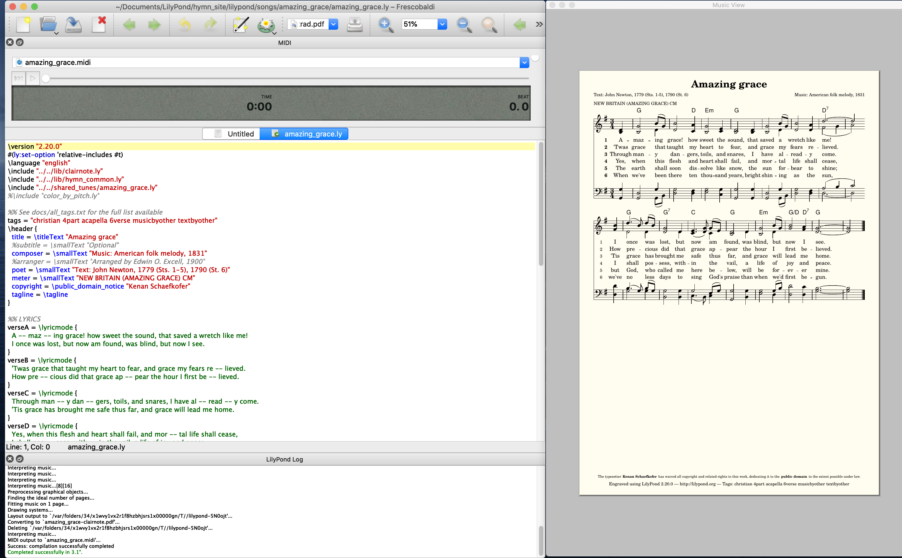

---
---

# Contributing using Lilypond + Frescobaldi

(For more advanced users, see the [Lilypond + Visual Studio Code setup](vscode))

All the songs on the site are written using Lilypond, which is a way to describe a musical score using code. Frescobaldi is an easy-to-use GUI (graphical user interface) for Lilypond.

### Installing

You will need:
 - [Lilypond](http://lilypond.org/download.html), the program that turns a file of code: `my_song.ly` into outputs `my_song.pdf` and `my_song.midi`. Hymn Singer currently uses 2.20.0, and the newer versions may be fine.
 - [Frescobaldi](https://frescobaldi.org/download), the easiest way to get started with Lilypond on Linux, Mac, or Windows.
 - (optional) [Git](https://git-scm.com/downloads)

### Clone the git repository

You're going to copy this entire website, including all the songs, to your computer.
- If you're comfortable with git: `git clone https://github.com/kenanbit/hymnsinger.git`
- Otherwise, go to <https://github.com/kenanbit/hymnsinger> Click the big green download button. You can download a zip and unzip it.

### Getting a song to engrave correctly

To "engrave" (meaning turn the `.ly` file into `.pdf` and `.midi` outputs):
- Open Frescobaldi
- Open the source code (the `.ly` file) for one of the songs. For example, "Angels we have heard on high" is at `lilypond/songs/angels_we_have_heard_on_high/angels_we_have_heard_on_high.ly`
- Hit the lilypad button to engrave. It should look something like this:

- If the notation looks strange to you, you need to use the dropdown menu next to the engrave button to select a different PDF file to view. (One of them is traditional notation, one uses shape-note heads, and one uses Clairnote notation. You get three for the price of one!)
- Find and replace "Kenan Schaefkofer" with your name, and re-engrave to see the change. Now _you_ are the one doing the typesetting and (hopefully) making your contributions free for all!

### Leverage your individual creative energies

Experiment by changing things!
- Maybe change the title, or some of the lyrics and see if your changes show up in the PDF.
- Change some note letters in the `soprano = `, `alto = `, etc. For example, maybe change the first `a4` to `gs4` to change the soprano's first quarter note from `A` to `G#`.
- Then go [learn the basics of Lilypond](https://lilypond.org/doc/v2.20/Documentation/learning/simple-notation)

### Audio playback

If you want to _hear_ the music, you will need to install a program to play (synthesize) `.midi` files:
 - Linux instructions: <https://github.com/frescobaldi/frescobaldi/wiki/MIDI-playback-on-Linux>
 - Mac instructions: <https://github.com/frescobaldi/frescobaldi/wiki/MIDI-playback-on-Mac-OS-X>
 - Windows actually has a built-in midi synthesizer that I think is just running all the time? You just need to select it.

Then, with the synthesizer application running, go into Frescobaldi's settings and change the MIDI output device to the synthesizer.

### Creating a new song

Now that you have everything set up, read about [Creating a new song](how-to-new-song)