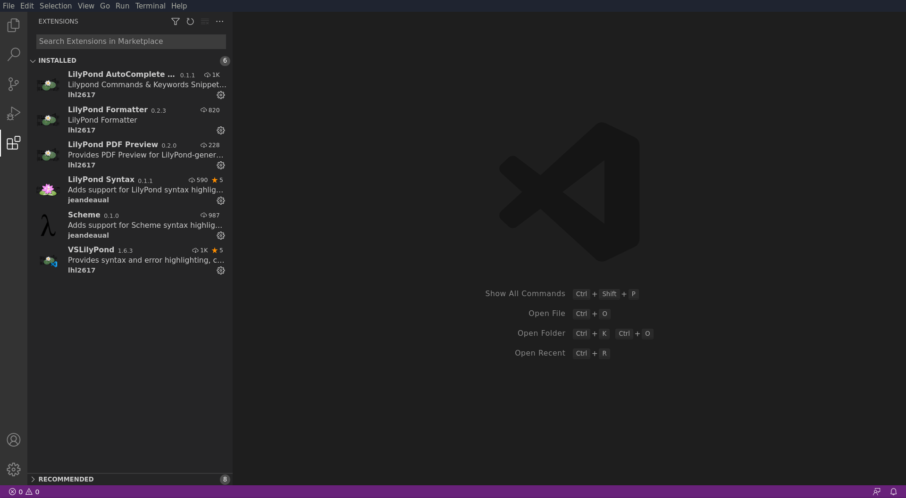
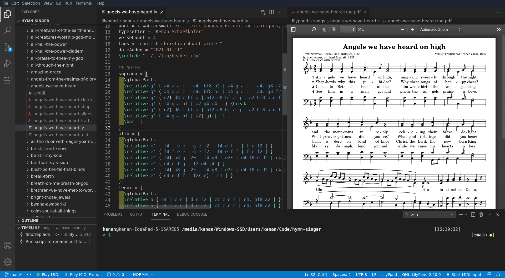

---
---

# Visual Studio Code as a Lilypond IDE

(Beginners should first work through [Lilypond + Frescobaldi setup](contributing))

Visual Studio Code is a powerful open-source IDE with a dizzying array of helpful extensions. It's straightforward to install Lilypond extensions to turn VSCode into a powerful Lilypond IDE. (Many thanks to lhl2617 for creating the extension and suggesting edits to this page.)

### Installing

You will need:
1. Install Lilypond 2.20.0: http://lilypond.org/download.html>
    - On windows, you need to change your PATH as described on the download page. For example, add this to your system path: `C:\Program Files (x86)\LilyPond\usr\bin`. This allows VSCode to find where `lilypond` is at.
1. Install Visual Studio Code: <https://code.visualstudio.com/download>
1. Clone our website for all the song examples: `git clone https://github.com/kenakofer/hymnsinger.git`

### Configuring

To set up Visual Studio Code for Lilypond development:
1. Open Visual Studio Code
1. Choose "Open folder", navigate to where the repository was downloaded, and click "Open" just inside. You should see a few files and directories, like `README.md` and `docs/`
1. Click on the Extensions icon tab on the left side of the screen (Ctrl+Shift+X)
1. Install the `VSLilyPond` extension (This will automatically install several extensions). These extensions:
  - run lilypond whenever a .ly file is saved;
  - generate PDF and MIDI outputs in the same directory
  - provide error highlighting, autocomplete, and code formatting
  - PDF viewer, where clicking on a note will place your cursor on that note in the source
  - midi playback (see below for configuration)
  - midi input for note entry (haven't tried using this yet)
1. The installed extensions look like this:

1. Exit and restart VSCode for extensions to take full effect
1. Click on the Explorer icon tab on the left side of the screen (Ctrl+Shift+E)
1. Open the file dropdowns and double click `lilypond/songs/angels-we-have-heard-on-high/angels-we-have-heard-on-high.ly` (The code in the file should be colored by the syntax highlighter.)
1. Try saving (Ctrl-S). You should see the `angels-we-have-heard-on-high/` directory get populated with some PDF files and a midi file.
1. Double click `angels-we-have-heard-on-high-trad.pdf` to open it. Optionally, drag the PDF file to the right side of the window, to open a second pane alongside the editor.
1. Find and replace "Kenan Schaefkofer" with your name, and re-engrave to see the change. Now _you_ are the one doing the typesetting and (hopefully) making your contributions free for all!
1. Your setup may look something like this:

1. Buttons to play, pause, and stop MIDI playback are in the bottom bar, BUT they won't work until you [install and configure a MIDI synthesizer](contributing#audio-playback), and then in VSCode, use Ctrl-Shift-P to run a command, and enter `vslilypond.setOutputMIDIDevice`, then select the synthesizer currently running.

### Creating a new song

Now that you have everything set up, read about [Creating a new song](how-to-new-song)